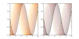

.. raw:: html

    

Examples
========

.. _examples-index:

.. _examples_gallery:

General examples
-------------------

General-purpose and introductory examples for the `mpltools`.

   :ref:`example_plot_cycle_cmap.py`

.. raw:: html

    

    