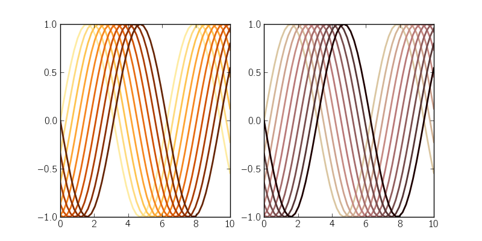

.. _example_plot_cycle_cmap.py:

===========================
Color cycle from a colormap
===========================

``cycle_cmap`` provides a simple way to set the color cycle to evenly-spaced
intervals of a given colormap. By default, it alters the default color cycle,
but if you pass it a plot axes, only the color cycle for the axes is altered.

**Python source code:** :download:`plot_cycle_cmap.py <plot_cycle_cmap.py>`
(generated using ``mpltools`` |version|)

.. literalinclude:: plot_cycle_cmap.py
    :lines: 11-
    